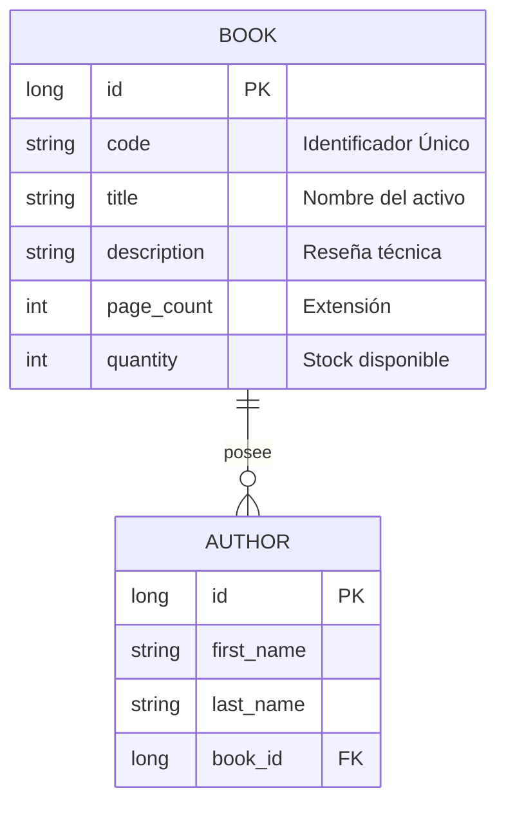

# 🏦 Digital Bank Lib: Corporate Assets Inventory


**Digital Bank Lib** es un ecosistema Full-Stack de alto rendimiento diseñado bajo los estándares visuales y de seguridad de la **Banca Digital Moderna**. La plataforma centraliza la gestión de activos bibliográficos corporativos, implementando una arquitectura reactiva y una experiencia de usuario (UX) de grado institucional.

---

## 🚀 Funcionalidades Clave

*   **📦 Gestión de Inventario:** Control de existencias (stock) en tiempo real y asignación de códigos SKU/ISBN únicos por activo.
*   **✍️ Registro Multi-Autor:** Módulo dinámico que permite crear y vincular autores en el mismo flujo de registro del libro mediante `FormArrays`.
*   **🔐 Seguridad por Roles (RBAC):** 
    *   **Administrador:** Control total sobre el ciclo de vida de los datos (CRUD).
    *   **Visitante:** Perfil restringido orientado a la consulta y auditoría visual.
*   **🔍 Buscador Híbrido:** Algoritmo de filtrado avanzado que procesa coincidencias por **Título** o **Código de Activo** de forma simultánea.
*   **🌓 Interfaz Dual:** Soporte nativo para **Modo Oscuro (Midnight)** y **Modo Claro**, optimizado para entornos de alta productividad.

---

## 🏛️ Arquitectura del Sistema

### 🎨 Frontend (`/frontend`)
- **Core:** Angular 21 con gestión de estado reactivo mediante **Signals**.
- **UI/UX:** Angular Material (MDC) con un sistema de estilos SCSS de alta densidad y efectos *Glow*.

### ⚙️ Backend (`/backend`)
- **Nivel:** Java 21 + Spring Boot 4.
- **Persistencia:** Spring Data JPA con transaccionalidad robusta.
- **Relaciones:** Mapeo bidireccional con guardado en cascada y eliminación de huérfanos.

---

## 📊 Modelo de Datos (ERD)

Estructura de base de datos que garantiza la integridad referencial del inventario:



---

## 🔑 Credenciales de Acceso


| Rol Institucional | Usuario | Contraseña |
| :--- | :--- | :--- |
| **Administrador** | `admin` | `1234` |
| **Visitante** | `user` | `0000` |

---

## ⚙️ Guía de Ejecución Local

### 1. Servicios Core (Backend)
```bash
cd backend
mvn spring-boot:run
```
> 📑 **Swagger UI:** [http://localhost:8081/swagger-ui/index.html](http://localhost:8081/swagger-ui/index.html)

### 2. Interfaz de Usuario (Frontend)
```bash
cd frontend
npm install
ng serve -o
```
> 🌐 **App URL:** [http://localhost:4200](http://localhost:4200)

---

## 📌 Notas Técnicas
- **Desacoplamiento:** Backend y Frontend corren de forma independiente para facilitar el escalado.
- **Clean Code:** Implementación de interfaces y servicios bajo principios de arquitectura limpia.
- **Contexto:** Ideal para entornos corporativos, financieros o académicos de alta demanda.

---
© 2026 **Digital Bank Lib** — *Corporate Assets Engineering Division.*
