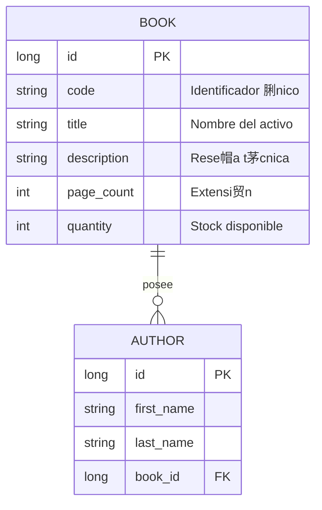

# 馃彟 Digital Bank Lib: Corporate Assets Inventory


**Digital Bank Lib** es un ecosistema Full-Stack de alto rendimiento dise帽ado bajo los est谩ndares visuales y de seguridad de la **Banca Digital Moderna**. La plataforma centraliza la gesti贸n de activos bibliogr谩ficos corporativos, implementando una arquitectura reactiva y una experiencia de usuario (UX) de grado institucional.

---

## 馃殌 Funcionalidades Clave

*   **馃摝 Gesti贸n de Inventario:** Control de existencias (stock) en tiempo real y asignaci贸n de c贸digos SKU/ISBN 煤nicos por activo.
*   **鉁嶏笍 Registro Multi-Autor:** M贸dulo din谩mico que permite crear y vincular autores en el mismo flujo de registro del libro mediante `FormArrays`.
*   **馃攼 Seguridad por Roles (RBAC):** 
    *   **Administrador:** Control total sobre el ciclo de vida de los datos (CRUD).
    *   **Visitante:** Perfil restringido orientado a la consulta y auditor铆a visual.
*   **馃攳 Buscador H铆brido:** Algoritmo de filtrado avanzado que procesa coincidencias por **T铆tulo** o **C贸digo de Activo** de forma simult谩nea.
*   **馃寭 Interfaz Dual:** Soporte nativo para **Modo Oscuro (Midnight)** y **Modo Claro**, optimizado para entornos de alta productividad.

---

## 馃彌锔?Arquitectura del Sistema

### 馃帹 Frontend (`/frontend`)
- **Core:** Angular 21 con gesti贸n de estado reactivo mediante **Signals**.
- **UI/UX:** Angular Material (MDC) con un sistema de estilos SCSS de alta densidad y efectos *Glow*.

### 鈿欙笍 Backend (`/backend`)
- **Nivel:** Java 21 + Spring Boot 4.
- **Persistencia:** Spring Data JPA con transaccionalidad robusta.
- **Relaciones:** Mapeo bidireccional con guardado en cascada y eliminaci贸n de hu茅rfanos.

---

## 馃搳 Modelo de Datos (ERD)

Estructura de base de datos que garantiza la integridad referencial del inventario:



---

## 馃攽 Credenciales de Acceso


| Rol Institucional | Usuario | Contrase帽a |
| :--- | :--- | :--- |
| **Administrador** | `admin` | `1234` |
| **Visitante** | `user` | `0000` |

---

## 鈿欙笍 Gu铆a de Ejecuci贸n Local

### 1. Servicios Core (Backend)
```bash
cd backend
mvn spring-boot:run
```
> 馃搼 **Swagger UI:** [http://localhost:8081/swagger-ui/index.html](http://localhost:8081/swagger-ui/index.html)

### 2. Interfaz de Usuario (Frontend)
```bash
cd frontend
npm install
ng serve -o
```
> 馃寪 **App URL:** [http://localhost:4200](http://localhost:4200)

---

## 馃搶 Notas T茅cnicas
- **Desacoplamiento:** Backend y Frontend corren de forma independiente para facilitar el escalado.
- **Clean Code:** Implementaci贸n de interfaces y servicios bajo principios de arquitectura limpia.
- **Contexto:** Ideal para entornos corporativos, financieros o acad茅micos de alta demanda.

---
漏 2026 **Digital Bank Lib** 鈥?*Corporate Assets Engineering Division.*
